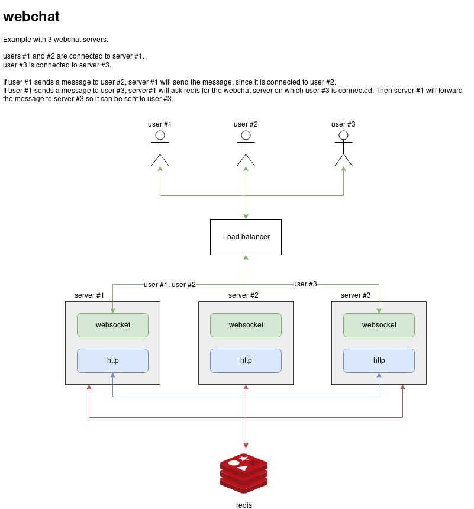

# webchat

webchat is a simple one-to-one chat server on browsers.

# Requirements

- a Kubernetes cluster
- helm
- docker
- [a browser with websockets](https://caniuse.com/#feat=websockets)

# Build

## Docker image

In the root directory:

```shell
$ docker build -f build/Dockerfile -t fluxracine/webchat:latest .
```

This will compile the Go code and create a lightweight Docker image.

# Deploy

## Minikube

> You need to build the docker image directly on the minikube VM.
> To achieve that, run: `eval $(minikube docker-env)` and then build the image.

`webchat` is deployed via a Helm chart, located in `deploy/webchat`. 

It installs a Redis server and a webchat server. Read `deploy/webchat/values.yaml` for configuration values.

To install the chart:

```shell
$ helm install --name webchat deploy/webchat -f deploy/minikube.yaml
```

Execute the following commands to get the server URL:
```shell
$ export NODE_PORT=$(kubectl get --namespace default -o jsonpath="{.spec.ports[0].nodePort}" services webchat)
$ echo http://`minikube ip`:$NODE_PORT
```

# How it works
